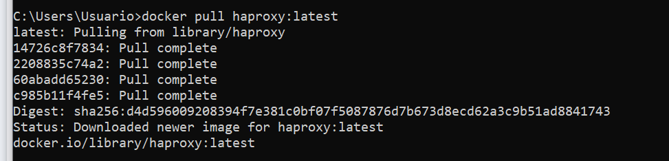

## Descripción:
> Se crearán 4 contenedores con Docker:
> 1. Un contenedor con la imagen **mysql:debian**
> 2. Un contenedor con la imagen **php:apache-bullseye**: el cual contendrá el primer servidor que alojará un simple index.php que deberá servir.
> 3. Otro contenedor con la imagen  **php:apache-bullseye**: el cual contendrá el segundo servidor que alojará el mismo index.php que el primer servidor.
> 4. Finalmente, crearemos un contenedor con la imagen **haproxy:lataest**: el cual contendrá un balanceador de carga que redirigirá las peticiones alternando entre el primer y segundo servidor sucesivamente.

#### Funcionamiento:
Con un navegador de nuestra máquina deberemos hacer una petición a localhost:8085 y este deberá recibir el sitio web que sirve el primer servidor. Luego de actualizar la página, nuestro balanceador deberá interceder y enviar la petición al segundo servidor, que servirá la misma página del servidor 1.
Ahora bien, nuestros servidores se comunicarán con una base de datos que se alojará en el contenedor de mysql. Esta base de datos tendrá algunos datos cargados a mano por nosotros mismos para que la simulación de una consulta a la base de datos por parte de nuestros servidores tenga sentido.


## Características
#### SO: Windows 10.

## Requerimientos:
1. Tener instalado **Docker Desktop**

## Procedimiento

### Primero descargamos las imágenes que necesitemos

Usamos el comando:
```
docker pull <nombre_de_la_imagen>
```

```
docker pull php:apache-bullseye
```

```
docker pull mysql:debian
```

```
docker pull haproxy:latest
```




### Creamos los contenedores

#### 1ro. Contenedor del gestor de bases de datos MySQL

```
docker run -d -p 3306:3306 -v "C:\Users\Usuario\Dropbox\DESCARGAS TEMPORALES CLASSROOMok\saIII-MicroServicios\contenedoresConApacheYMysql\mysqlVolumen":/var/lib/mysql --name mimsql -e MYSQL_ROOT_PASSWORD=pass mysql:debian
```

![[Pasted image 20230817104710.png]]

Vemos que estamos creando un volumen, que persistirá los datos del sistema de archivos del contendor en la ruta `/var/lib/mysql` en nuestro sistema de archivos de nuestra máquina local `C:\Users\Usuario\Dropbox\DESCARGAS TEMPORALES CLASSROOMok\saIII-MicroServicios\contenedoresConApacheYMysql\mysqlVolumen`
Esto nos permitirá crear tantas bases de datos, tablas y registros como queramos; y por más que eliminemos el contendor, estos datos no se perderán pues estarán guardados en el sistema de archivos de nuestra máquina local.

###### Importante:
La contraseña para este contenedor: **`-e MYSQL_ROOT_PASSWORD=pass` debe ser la misma que la que colocamos en nuestro fichero ``index.php``**.

##### Configuración del contenedor mysql

Para ingresar al contenedor ejecutamos:
```
docker exec -it mimsql bash
```

Luego para ingresar al gestor de bases de datos:
```
mysql -u root -p
```
Y proporcionamos la contraseña que le dimos al crear el contenedor, en nuestro caso: `pass`

![[Pasted image 20230817104815.png]]

Con esto podremos empezar a crear datos para usar en nuestro ejemplo.

![[Pasted image 20230817105234.png]]

![[Pasted image 20230817105442.png]]

Para salir ejecutamos:
```
exit
```

Como debemos saber la IP de nuestro contenedor mysql para luego conectarlo con los contenedores de los servidores, ejecutamos:

```
docker inspect mimsql
```
![[Pasted image 20230817105648.png]]

#### 2do. Contenedor del servidor 1 de php:apache

Antes de crear el contenedor debemos tener en cuenta algunas configuraciones.
##### Configuración del fichero index.php
Este fichero es el que se "servirá" cuando el contenedor del servidor se ejecute. Por lo tanto, es en este fichero donde debemos configurar la conexión a la base de datos (al contenedor de nuestro sistema gestor de bases de datos).
La configuración es:
```
<?php
    $servername = "172.17.0.2";
    $username = "root";
    $password = "pass";
    $dbname = "prueba";

```

Vemos que la variable `$servername` **alojará la ip del contenedor que ejecuta el sistema gestor de bases de datos**.
Y la variable `$pass="pass"` es la misma que la usada al crear el contenedor.


##### Creamos el contenedor

```
docker run -d -p 8088:80 --name myServer -v "C:\sitio1":/var/www/html php:apache-bullseye
```
![[Pasted image 20230817113133.png]]

Vemos que estamos creando un volumen, que persistirá los datos del sistema de archivos del contendor en la ruta `/var/www/html` en nuestro sistema de archivos de nuestra máquina local `C:\sitio1`

###### Importante:
Es en esta ruta (`C:\sitio1`) donde deberá estar alojado el fichero **index.php**. Así el contenedor del servidor creado podrá servir nuestro sitio web que se conectará con la base de datos del contenedor mysql.

##### Configuración del contenedor


Para ingresar al contenedor ejecutamos:
```
docker exec -it myServer bash
```

Actualizamos los paquetes instalados:
```
apt-get update
```

![[Pasted image 20230817113226.png]]

Ahora debemos instalar ciertos paquetes o "**drivers**" en este contenedor para que el servidor tenga la capacidad de conectarse a la base de datos:


```
apt-get install -y libmysqli-dev
```

```
docker-php-ext-install mysqli
```

```
docker-php-ext-enable mysqli
```

##### Otros
Como debemos saber la IP de nuestro contenedor **php:apache** para luego utilizarla en la configuración del balanceador, ejecutamos:

```
docker inspect myServer
```


#### 3ro. Contenedor del servidor 2 de php:apache

Antes de crear el contenedor debemos tener en cuenta algunas configuraciones.
##### Configuración del fichero index.php
Este fichero es el que se "servirá" cuando el contenedor del servidor se ejecute. Por lo tanto, es en este fichero donde debemos configurar la conexión a la base de datos (al contenedor de nuestro sistema gestor de bases de datos).
La configuración es:
```
<?php
    $servername = "172.17.0.2";
    $username = "root";
    $password = "pass";
    $dbname = "prueba";

```

Vemos que la variable `$servername` **alojará la ip del contenedor que ejecuta el sistema gestor de bases de datos**.
Y la variable `$pass="pass"` es la misma que la usada al crear el contenedor.


##### Creamos el contenedor

```
docker run -d -p 8087:80 --name myServer2 -v "C:\sitio2":/var/www/html php:apache-bullseye
```

Vemos que estamos creando un volumen, que persistirá los datos del sistema de archivos del contendor en la ruta `/var/www/html` en nuestro sistema de archivos de nuestra máquina local `C:\sitio2`

###### Importante:
Es en esta ruta (`C:\sitio2`) donde deberá estar alojado el fichero **index.php**. Así el contenedor del servidor creado podrá servir nuestro sitio web que se conectará con la base de datos del contenedor mysql.

##### Configuración del contenedor

Para ingresar al contenedor ejecutamos:
```
docker exec -it myServer2 bash
```

Actualizamos los paquetes instalados:
```
apt-get update
```

Ahora debemos instalar ciertos paquetes o "**drivers**" en este contenedor para que el servidor tenga la capacidad de conectarse a la base de datos:

```
apt-get install -y libmysqli-dev
```

```
docker-php-ext-install mysqli
```

```
docker-php-ext-enable mysqli
```

##### Otros
Como debemos saber la IP de nuestro contenedor **php:apache** para luego utilizarla en la configuración del balanceador, ejecutamos:

```
docker inspect myServer2
```


#### 4to. Contenedor para el balanceador haproxy

##### Crear un directorio en nuestra máquina para mapear un volumen al contenedor del balanceador.
En mi caso:
```
C:\volumenBalanceador
```
 * Dentro de este directorio crear el fichero: **haproxy.cfg**
 * En este fichero colocar las configuraciones de nuestro balanceador:
```
global
    log 127.0.0.1 local0 notice
    pidfile /tmp/haproxy.pid
    daemon
defaults
    log global
    mode http
    option httplog
    option dontlognull
    timeout connect 5000
    timeout client 50000
    timeout server 50000
frontend http_front
    bind *:80
    mode http
    default_backend http_back
backend http_back
    balance roundrobin
    cookie JSESSIONID prefix indirect nocache
    server myServer 172.17.0.4:80 check
    server myServer2 172.17.0.3:80 check

```

	# **Asegurarse de dejar una línea en blanco al final del fichero para que exista un salto de línea en la última línea escrita.** 


 * Otras configuraciones:
```
global
    maxconn 256

defaults
    mode http
    timeout connect 5000ms
    timeout client 50000ms
    timeout server 50000ms

frontend http-in
    bind *:8088
    default_backend servers

backend servers
    balance roundrobin
    server myServer 172.17.0.2:80
	server myServer2 172.17.0.4:80
```


```
global
    log 127.0.0.1 local0 notice
    chroot /var/lib/haproxy
    stats socket /run/haproxy/admin.sock mode 660 level admin
    stats timeout 30s
    user haproxy
    group haproxy
    daemon

defaults
    log global
    mode http
    option httplog
    option dontlognull
    timeout connect 5000
    timeout client 50000
    timeout server 50000

frontend http_front
    bind *:80
    mode http
    acl auth_ok http_auth(myrealm)
    http-request auth realm myrealm if !auth_ok
    default_backend http_back

backend http_back
    balance roundrobin
    cookie JSESSIONID prefix indirect nocache
    server server1 192.168.1.10:80 check
    server server2 192.168.1.11:80 check

listen stats
    bind :9000
    mode http
    stats enable
    stats uri /haproxy
    stats realm Strictly\ Private
    stats auth admin:yourpassword

```

```
global
    log 127.0.0.1 local0 notice
    chroot /var/lib/haproxy
    stats socket /run/haproxy/admin.sock mode 660 level admin
    stats timeout 30s
    user haproxy
    group haproxy
    daemon

defaults
    log global
    mode http
    option httplog
    option dontlognull
    timeout connect 5000
    timeout client 50000
    timeout server 50000

frontend http_front
    bind *:80
    mode http
    default_backend http_back

backend http_back
    balance roundrobin
    cookie JSESSIONID prefix indirect nocache
    server server1 192.168.1.10:80 check
    server server2 192.168.1.11:80 check

listen stats
    bind :9000
    mode http
    stats enable
    stats uri /haproxy
```

##### Crear el contenedor:

```
docker run -d -p 8085:80 --name balancer -v "C:\volumenBalanceador":/usr/local/etc/haproxy/ haproxy:latest
```

Vemos que estamos creando un volumen, que persistirá los datos del sistema de archivos del contendor en la ruta `/usr/local/etc/haproxy/` en nuestro sistema de archivos de nuestra máquina local `C:\volumenBalanceador`

###### Importante:
Es en esta ruta (`C:\volumenBalanceador`) donde deberá estar alojado el fichero **haproxy.cfg**. Así, el contenedor del balanceador creado podrá controlar las peticiones que llegan a este y redirigirlas a los dos servidores que configuramos previamente. Al llegar una petición, el balanceador la redirigirá al servidor 1, al llegar la siguiente petición, la redirigirá al servidor 2, si llega otra petición, esta será redirigida al servidor 1; y así sucesivamente.

![[Pasted image 20230818142826.png]]


![[Pasted image 20230818142803.png]]


